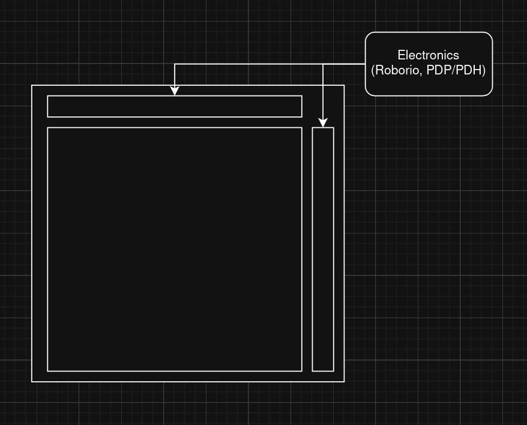

# Rebuilt Bad Idea Bot -- Logbook

By the end of this season, I have finally discovered the true meaning of **Rebuilt**: 
***rebuild your entire robot.*** 

What if I designed a robot made entirely out of bad ideas? Every janky fix, every over-engineered solution, and every "so crazy it just might work" concept all rolled into one machine.

Presenting my summer project:

* **R**idiculous
* **E**ngineering
* **B**uffoonery
* **U**tilizing
* **I**diotic
* **L**anes of
* **T**echnology

Since I am just one person (and definitely not made of money), this will be a **CAD-only project**.

**The Design Goals:**

* **Maximum Ridiculousness:** If it makes mentors disappointed, it belongs on the robot.
* **Deceptively Functional:** It needs to look like it *could* actually work on a field.
* **The Constraints:** It must be FRC legal... *except* for the part cost / availability limit, and maybe other minor violations.

I’ll be hosting a build blog and posting updates on this project website.

**So, what terrible ideas should I add first?**

Either add to the thread on [Chief Delphi](https://www.chiefdelphi.com/t/rebuilt-bad-idea-summer-robot-cad-only/521751), or [submit a GitHub issue](https://github.com/el-8248/rebuilt-bad.idea.bot/issues/new) on this repository with the "Idea" label.

#### 2026/6/8 23:44:44 PDT

# [CAD Link](https://cad.onshape.com/documents/6183ad144dd769a4084ed060/)
# 001 - Setup
1. Create Document Structure

* Assembly - Main
    * Assembly - Shooter
    * Assembly - Intake
    * Assembly - Indexer
    * Assembly - Chassis
    * Assembly - Climber
    * Assembly - Bumpers

I might go to bed now
#### 2026/6/9 00:00:00 PDT
---
# 002 - Ideation
So after looking at people's ideas, I have decided on the basic structure of the robot for some components.

Shooter
-
Dual Turret

either Differential or Coaxial

Why? Because Aura.

(and I hate my life)

Drive
-
Tank Treads

Because it's funny

and I will be violating the 4 motor limit, but that's okay.

Last Crazy Thing
-
Electronics Mounted On/In the Hopper

#### 2026/6/9 09:21:42 PDT
